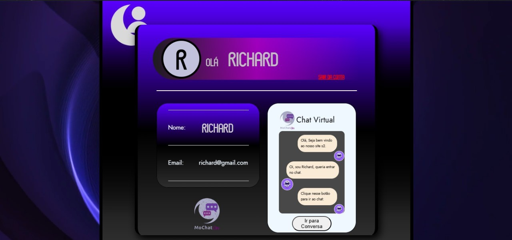

# Projeto de Conclusão de disciplina. *(12/2024)*

## 💬🗨 Projeto MoChatOn – Chat Web com visualização em tempo real entre navegadores da mesma máquina.
Este projeto é um Chat Web com o nome "MoChatOn" no qual funciona inteiramente com Javascript e LocalStorage.

# Funcionalidades do Sistema
## 👥 Área pública
Nesse projeto, o usuário tem a possibilidade de criar a sua conta, entrar para a página de Chat, e trocar mensagens com outras contas cadastradas em LocalStorage no site e alternar entre elas.
Nele, a interação em tempo real acontece com as abas de navegador diferentes no mesmo Desktop.

- Criação de Contas e personalização.

- Troca de mensagens via Contas para cada outra conta cadastrada.

- Troca de mensagens via Contas em um grupo com todas as contas cadastradas.

## Tecnologias Utilizadas
- HTML– Criação da base do site.

- CSS – Para design do Front-End.

- Javascript – Para interações dinâmicas no Front-End e interação em tempo real entre navegadores.

- Javascript(LocalStorage) – Para simular um banco de dados e guardar as informações do site.

###  Utilização de GitHub para versionamento de versões.
